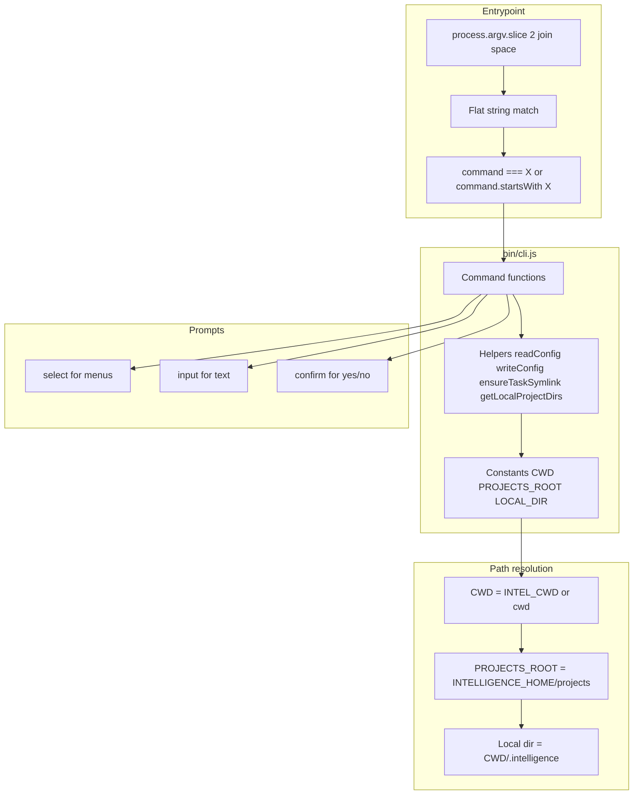

# Intel CLI: Commands, Architecture, and Testing

Unified documentation for the `intel` CLI: architecture, command implementation, and testing. **Whenever you create a new command or fix a bug, you must add or update tests.** Untested behavior is not done.

---

## Architecture overview



### Key constants (module-level)

| Constant | Source | Purpose |
|----------|--------|---------|
| `CWD` | `INTEL_CWD` env or `process.cwd()` | Current working directory (repo root) |
| `INTELLIGENCE_HOME` | `INTELLIGENCE_HOME` env or `~/.intelligence` | Global store root |
| `PROJECTS_ROOT` | `INTELLIGENCE_HOME/projects` | Where projects and tasks live |
| `LOCAL_DIR` | `.intelligence` | Local config and symlinks |

### Path layout

```
~/.intelligence/projects/           # Global store (PROJECTS_ROOT)
  <project>/<task>/docs|context/

<repo>/.intelligence/               # Local (CWD + LOCAL_DIR)
  config.yaml                       # active-project, active-task
  <project>/<task> -> symlink       # Points to global store
```

### Available helpers

| Helper | Purpose |
|--------|---------|
| `readConfig()` | Returns `{ 'active-project', 'active-task' }` from `.intelligence/config.yaml`; throws if missing |
| `writeConfig(config)` | Writes active-project and active-task to config |
| `ensureProjectsRoot()` | Creates `PROJECTS_ROOT` if missing |
| `ensureTaskSymlink(project, task)` | Creates symlink at `.intelligence/<project>/<task>` → task dir in store |
| `getLocalProjectDirs()` | Returns project names under `.intelligence/` (excludes config.yaml) |

---

## Command organization

- **Single file:** All commands live in `bin/cli.js`. No separate router or subcommand loader.
- **Flat string match:** `process.argv.slice(2).join(' ')` produces a single string (e.g. `active task`).
- **Routing order:** More specific commands must appear before general ones. Example: `drop project` before `drop task` before any `drop` prefix.

### Data source patterns

| Command type | Where to list items | Example |
|--------------|---------------------|---------|
| Global store | `PROJECTS_ROOT` | `delete task`, `delete project`, `import` |
| Local symlinks | `getLocalProjectDirs()` + `.intelligence/<project>/` | `drop task`, `drop project` |
| Active context | `readConfig()` | `intel git`, `drop task <name>` (with arg) |

### Prompt patterns

| Pattern | Use case | Example |
|---------|----------|---------|
| `select()` | Choose from list | Project, task |
| `input()` | Free text | Task name, URL, project name |
| `confirm()` | Destructive action | Delete, drop project |

**Queue order in tests:** Prompts are consumed in call order. If a command uses `select` then `confirm`, set `selectQueue` and `confirmQueue` in that order.

---

## Algorithm: implementing a new command

### Step 1: Decide command shape

- **Exact match:** `command === 'foo'` — single word
- **Subcommand:** `command === 'foo bar'` — two words, more specific first
- **With args:** `command.startsWith('foo ')` — pass `command.slice(4).trim()` to handler

### Step 2: Implement the handler

```js
async function myCommand(optionalArg) {
  try {
    // 1. Validate preconditions (config, paths)
    readConfig();  // or const config = readConfig() if you need it

    // 2. Gather input (select, input, confirm)
    const x = await select({ message: '...', choices: [...] });
    const ok = await confirm({ message: '...', default: false });

    // 3. Perform action (fs, spawnSync, etc.)
    // 4. Optional: cleanup (e.g. remove empty dirs)
    // 5. console.log('\nDone.');
  } catch (err) {
    if (err.name === 'ExitPromptError') {
      process.exit(130);
    }
    console.error('Error:', err.message);
    process.exit(1);
  }
}
```

- Use **sync** (`function myCommand()`) when there are no prompts (e.g. `intel git` reads config and runs spawnSync).
- Use **async** when you need `select`, `input`, or `confirm`.

### Step 3: Add routing in the entrypoint

```js
const command = process.argv.slice(2).join(' ');

if (command === 'exact') {
  await exactCommand();
} else if (command.startsWith('prefix ')) {
  await prefixCommand(command.slice(7).trim() || undefined);
} else if (command === 'sub sub') {
  await subSubCommand();
// ... more specific before general
} else {
  // help
}
```

### Step 4: Update help and exports

- Add a line in the `else` block's usage text.
- Add the function to the `export { ... }` at the bottom for tests.

### Step 5: Add tests (mandatory)

See **Algorithm: creating new tests** below. Every new command must have tests before it is done.

---

## Error handling

- **ExitPromptError:** User pressed Ctrl+C → `process.exit(130)`.
- **Other errors:** Log message and `process.exit(1)`.
- **Early validation:** Check `readConfig()`, `fs.existsSync()`, non-empty lists before prompting.

---

## Testing infrastructure

### How to run tests

```bash
npm test
```

Uses Node.js built-in test runner (`node:test`) with module-level mocking. Requires Node.js 22+ and `--experimental-test-module-mocks`. Tests run in a fully sandboxed environment; they never touch the real `~/.intelligence/` or the user's working directory.

### Sandboxing

`bin/cli.js` resolves paths at module load time:

```js
const CWD = process.env.INTEL_CWD || process.cwd();
const INTELLIGENCE_HOME = process.env.INTELLIGENCE_HOME || path.join(os.homedir(), '.intelligence');
```

`createSandbox()` sets both env vars to temp dirs before the CLI is imported. Zero impact on normal usage since the variables are unset by default.

### Test helpers (test/helpers.js)

| Helper | Purpose |
|--------|---------|
| `createSandbox()` | Creates temp dirs, sets `INTELLIGENCE_HOME` and `INTEL_CWD`, returns `{ tmpDir, tmpHome, tmpProjectsRoot, tmpCwd, cleanup }` |
| `createConfig(cwd, project, task?)` | Creates `.intelligence/config.yaml` with `active-project` and optional `active-task` |
| `createProject(projectsRoot, name, tasks?)` | Creates project dir with optional task subdirs, each with `docs/` and `context/` |
| `createTaskSymlink(cwd, projectName, taskName, projectsRoot)` | Creates symlink at `.intelligence/<project>/<task>` → task dir in store |

Always use these. Do not inline the logic.

---

## Algorithm: creating new tests

**Rule:** Whenever you create a new command or fix a bug, you must add or update tests. Behavior that is not tested is not done.

### 1. Export the command function

Add the function to the exports at the bottom of `bin/cli.js`.

### 2. Create the test file

Create `test/<command>.test.js` (e.g. `test/foobar.test.js` for `intel foobar`).

### 3. Set up sandbox (before any import of cli.js)

```js
import { createSandbox, createConfig, createProject } from './helpers.js';

const { tmpProjectsRoot, tmpCwd, cleanup } = createSandbox();
```

### 4. Register mocks (before importing cli.js)

**Prompts** — include `confirm` for commands that use it:

```js
let selectQueue = [];
let inputQueue = [];
let confirmQueue = [];

mock.module('@inquirer/prompts', {
  namedExports: {
    select: async () => selectQueue.shift(),
    input: async () => inputQueue.shift() ?? '',
    confirm: async () => confirmQueue.shift(),
  },
});
```

**process.exit** — required for all commands that call it on error:

```js
mock.method(process, 'exit', () => {});
```

**child_process** — if the command uses `execSync` or `spawnSync`:

```js
import * as cp from 'child_process';

mock.module('child_process', {
  namedExports: {
    execSync: cp.execSync,
    spawn: cp.spawn,
    spawnSync: /* your mock or cp.spawnSync */,
  },
});
```

**Important:** The mock must provide all exports that `bin/cli.js` imports. If `cli.js` imports `spawnSync` and the mock omits it, the import will fail.

### 5. Import the CLI

```js
const { commandName } = await import('../bin/cli.js');
```

### 6. Map mock responses to command flow

The order of `select()`, `input()`, and `confirm()` calls determines the queue order. Populate queues in the same order the command consumes them.

### 7. Build fixtures with helpers

Use `createConfig`, `createProject`, and `createTaskSymlink`. Do not manually write config or create project dirs.

### 8. Cover corner cases

Every command should have tests for:

| Case | Fixture | Assertion |
|------|---------|-----------|
| Happy path | Full valid setup | Correct filesystem state, no `process.exit` |
| No config | Remove `.intelligence/` | `process.exit(1)` |
| Missing project dir | Config points to non-existent project | `process.exit(1)` |
| Missing projects root | Rename/remove `projects/` | `process.exit(1)` |
| Empty list | Empty `projects/` or empty tasks | `process.exit(1)` or early return |
| Already exists | Pre-create target dir/file | `process.exit(1)` |
| Invalid input | Empty string from prompt | `process.exit(1)` |
| User cancels | `confirm` returns false | No mutation, no `process.exit` |

### 9. Test isolation

Tests run in sequence and can mutate shared state. If a test removes `.intelligence/` or modifies fixtures, subsequent tests that need that state must recreate it. Reorder tests so that destructive tests run after non-destructive ones, or restore fixtures in `beforeEach` when needed.

### 10. Temporary mutations

When a test temporarily removes or renames a directory, always restore in `finally` so `after()` cleanup works:

```js
const backup = tmpProjectsRoot + '-backup';
fs.renameSync(tmpProjectsRoot, backup);
try {
  await commandUnderTest();
  assert.equal(process.exit.mock.calls.length, 1);
} finally {
  fs.renameSync(backup, tmpProjectsRoot);
}
```

### 11. Reset mocks between tests

```js
beforeEach(() => {
  process.exit.mock.resetCalls();
  selectQueue = [];
  confirmQueue = [];
});
```

### 12. Cleanup

```js
after(() => {
  cleanup();
});
```

### Verifying symlinks

```js
const linkPath = path.join(tmpCwd, '.intelligence', project, task);
assert.ok(fs.lstatSync(linkPath).isSymbolicLink());
assert.equal(fs.readlinkSync(linkPath), path.resolve(expectedTarget));
```

### Verifying process.exit

```js
assert.equal(process.exit.mock.calls.length, 1);
assert.deepStrictEqual(process.exit.mock.calls[0].arguments, [1]);
```

---

## CI

GitHub Actions runs tests on push and pull_request to `main`. See `.github/workflows/ci.yml`. Matrix: Node 22 and 24.

---

## Gotchas and edge cases

### execSync vs spawnSync

- **execSync** only accepts `(command, options)`; the second argument is **options**, not arguments to the command.
- **spawnSync** accepts `(command, args, options)` and correctly passes arguments.
- **Use spawnSync** when you need to run a command with arguments (e.g. `git status`, `git commit -m "message"`). Using `execSync('git', ['status'], opts)` incorrectly treats `['status']` as options and runs `git` with no args.

### Argument quoting

When building a command string for the shell, arguments with spaces can be split incorrectly. Use `spawnSync` with an array of arguments instead of constructing a string.

### child_process mock completeness

When mocking `child_process`, the mock must provide every export that `bin/cli.js` imports. If `cli.js` imports `{ execSync, spawnSync }`, the mock must include both. Otherwise the import fails with "Named export 'spawnSync' not found".

### Test order and shared state

Tests within a file run in sequence. If one test deletes a project or task, the next test may see an empty list. Fix by either: (a) reordering tests so destructive ones run last, or (b) restoring fixtures in `beforeEach` when needed.

### confirm in prompts mock

All mocks of `@inquirer/prompts` must include `confirm` (e.g. `confirm: async () => false`) because `cli.js` imports it. If any test file mocks prompts without `confirm`, the import fails.

---

## Command reference

| Command | Handler | Key logic |
|---------|---------|-----------|
| `ctx set active` | `setActive()` | selectOrCreateProject, selectTaskForProject or createTaskInProject if empty |
| `ctx new [name]` | `newTask(name?)` | ensureActiveProject, createTaskInProject |
| `ctx import` | `importTask()` | select from PROJECTS_ROOT, ensureTaskSymlink |
| `ctx git [args...]` | `intelGit()` | readConfig, spawnSync('git', args, { cwd: taskDir }) |
| `ctx drop task [name]` | `dropTask(name?)` | getLocalProjectDirs, unlink symlink, rmdir if empty |
| `ctx drop project` | `dropProject()` | getLocalProjectDirs, confirm, rm local dir |
| `ctx delete task` | `deleteTask()` | list from PROJECTS_ROOT, confirm, rm task + symlink |
| `ctx delete project` | `deleteProject()` | list from PROJECTS_ROOT, confirm, rm project + local dir |
| `ctx active` | `activeStatus()` | readConfig, print |

---

## Test files

| File | Command |
|------|---------|
| `test/set-active.test.js` | ctx set active |
| `test/new.test.js` | ctx new |
| `test/active.test.js` | ctx active |
| `test/import.test.js` | ctx import |
| `test/git.test.js` | ctx git |
| `test/drop-task.test.js` | ctx drop task |
| `test/drop-project.test.js` | ctx drop project |
| `test/delete-task.test.js` | ctx delete task |
| `test/delete-project.test.js` | ctx delete project |
